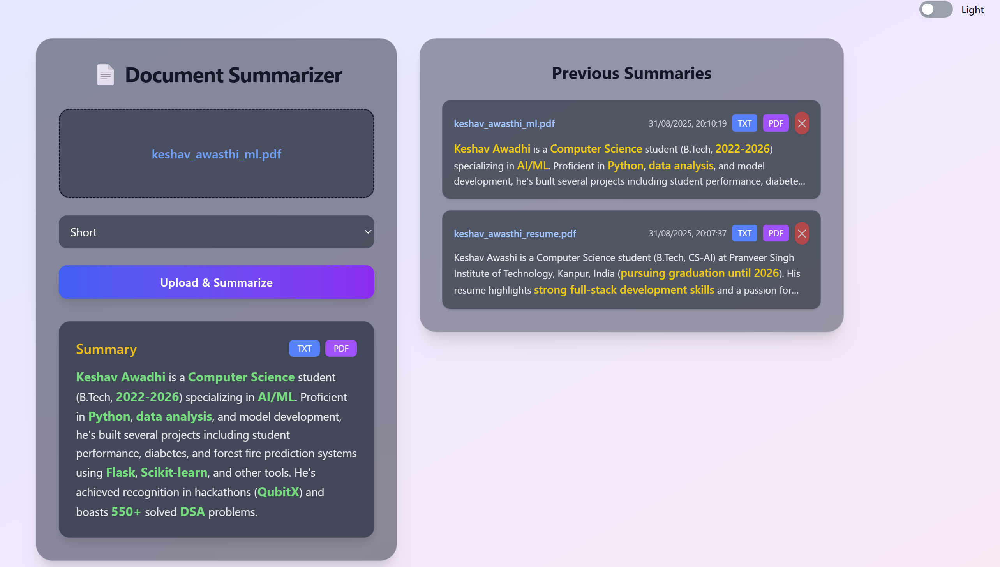

# 📝 Doc Summary Assistant — Frontend

A modern React + Vite web app for uploading documents (PDFs, images) and generating AI-powered summaries.  
Features a beautiful Carbon Glass UI, dark/light mode toggle, and local history management.

---

## ✨ Features

- **Upload PDF or Image**: Drag & drop or select files for instant summarization.
- **AI Summarization**: Uses Gemini AI (via backend) to generate concise summaries.
- **Carbon Glass UI**: Stunning glassmorphism design inspired by Carbon theme.
- **Dark/Light Mode**: Toggle between elegant dark and light themes.
- **History Panel**: View, select, and delete previous summaries (stored in browser localStorage).
- **Responsive Design**: Works beautifully on desktop and mobile.

---

## 🚀 Getting Started

### 1. Install dependencies

```bash
npm install
```

### 2. Run the frontend

```bash
npm run dev
```

Frontend will start on [http://localhost:5173](http://localhost:5173) by default.

### 3. Connect to Backend

Make sure the backend server is running and accessible at the URL specified in `.env`  
(e.g. `VITE_API_URL=http://localhost:5000`).

---

## 🖼️ UI Preview





---

## 🛠️ Tech Stack

- **React 19**
- **Vite**
- **Tailwind CSS**
- **Framer Motion** (animations)
- **Axios** (API calls)
- **LocalStorage** (history persistence)

---

## 📁 Project Structure

```
src/
  ├── components/
  │     └── UploadForm.jsx
  ├── App.jsx
  ├── index.js
  └── styles/
        └── theme.css
```

---

## 🌓 Dark & Light Mode

Easily toggle between dark and light themes using the switch in the top-right corner.

---

## 🗑️ History Management

- Click any summary in the history panel to view it again.
- Use the sticker-style ❌ button to delete individual summaries from localStorage.

---

## 📄 License

MIT

---

## 💡 Credits

- [React](https://react.dev/)
- [Vite](https://vitejs.dev/)
- [Tailwind CSS](https://tailwindcss.com/)
